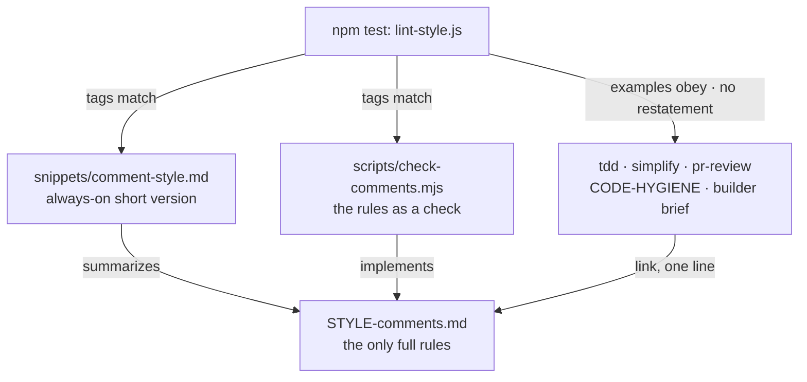

# Comment style has one source, and a check keeps it that way

**Status:** accepted

All rules for code comments live in [`skills/formats/STYLE-comments.md`](../../skills/formats/STYLE-comments.md). Every other file links it in one line and does not restate it. `npm test` fails when a copy or a contradiction appears.

## Context

Code written with these skills still collected too many comments, and they grew with every edit. The comment rules existed, but:

- They were restated in four places (`STYLE-comments.md`, `CODE-HYGIENE.md` Principle 6, `simplify`, `pr-review` §3f), each slightly different.
- They applied only after the code was written (`simplify`, `pr-review`), not in `tdd`, where comments are written.
- 19 code examples in `design/` and `tdd/` put a label comment above a function or test. Agents copy examples more than they follow rules.
- Skills load only when they fire, so the rules were absent from ordinary coding turns.

## Decision

1. **One source:** `STYLE-comments.md` holds the full rules. Other files link it and don't repeat them.
2. **Always on:** [`snippets/comment-style.md`](../../snippets/comment-style.md) is a short summary that the installer's `--style` flag writes into `CLAUDE.md` / `AGENTS.md` / `GEMINI.md`.
3. **As a check:** [`skills/scripts/check-comments.mjs`](../../skills/scripts/check-comments.mjs) applies the rules to a diff. `simplify` and `pr-review` run it.
4. **Drift guard:** [`scripts/lint-style.js`](../../scripts/lint-style.js), run by `npm test`, fails when:
   - the tag list differs between the source, the snippet, and the checker
   - a skill example breaks the rules (label above a function, narration, process tags)
   - another file restates the rules

## Considered options

- **Keep the rules duplicated per skill.** Rejected. The copies had already drifted.
- **Snippet only, no full reference.** Rejected. The snippet must stay short to be cheap on every turn, so it can't carry examples or the history commands.
- **Checker only, no written rules.** Rejected. A heuristic check can't judge whether a `WHY:` is true; the written rules can.
