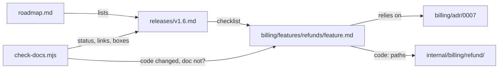

# Docs are grouped by domain, tracked by release, and checked on every change

We decided on one docs layout and three upkeep rules, all in [`skills/formats/DOCS-LAYOUT.md`](../../skills/formats/DOCS-LAYOUT.md):

1. **Scope decides the folder.** Domain docs go in `docs/<domain>/`; cross-domain docs stay top level. Each feature gets a folder for all its docs. A doc never moves.
2. **Status lives in frontmatter, and each change has one owner skill.**
3. **Milestones are release files.** `docs/releases/<version>.md` owns the checklist of features; `docs/roadmap.md` lists the releases.
4. **[`check-docs.mjs`](../../skills/scripts/check-docs.mjs) checks the rules.** It runs from Claude Code hooks (an installer option), pre-commit, and CI.

## Context

- **Hard to track.** A flat `docs/features/` grows without limit. It has no grouping by business domain or by release.
- **Paths disagreed.** Skills named different paths for the same doc: `docs/bench/` vs `docs/benchmarks/`, `CONTEXT-MAP.md` at the root vs in `docs/`, and domain docs next to the code (`src/billing/docs/`) vs under `docs/`. `architecture.md`, security reviews, and migration plans were missing from the OKF type table.
- **Docs went stale.** Agents finished code without updating docs or status. Status was kept twice, in frontmatter and in a `**Status:**` line, and nothing owned changing it.
- **Agents needed telling.** Nothing pointed an agent at the right doc, so the user had to say "read X first".

## Decision

- **Domain folders, created lazily.** A repo stays flat until a second domain appears. Domain names match the code folders.
- **ADR numbers stay global** across every `adr/` folder, so `ADR-0007` is never ambiguous.
- **Status values are lowercase and fixed per doc type.** Each change is made by one skill: `feature-doc` sets draft/approved, `tdd` sets building, `prod-ready` sets done, `release` sets shipped.
- **The release file owns membership, not the feature.** A slipped feature is one line moved to the next release file.
- **`docs/index.md` is generated** from frontmatter between markers.
- **Feature docs list their `code:` paths.** Hooks and the checker use them to map a changed file back to its doc.
- **Hooks are opt-in** (`--hooks`), so they're installed only when asked:
  - Session start lists the docs in flight.
  - Each edit names the docs that cover the file.
  - Stop blocks while the changed docs have problems.

## Considered options

- **Milestone folders** (`docs/m3/refunds/`). Rejected: a slipped feature moves, and every link to it breaks.
- **A `milestone:` field on each feature.** Rejected: membership would then live in two places, the field and the release list.
- **Domain docs next to the code** (`src/billing/docs/`). Rejected: it splits `docs/` into many trees, with no single index. A folder `CLAUDE.md` / `AGENTS.md` points from the code to the docs instead.
- **Stop hook that also blocks on re-check items.** Rejected: it would block every turn that touched covered code. The edit hook reminds instead.

## Consequences

- `docs/features/distributed-state.md` moved to `docs/features/distributed-state/feature.md`.
- Existing ADRs keep their `**Status:**` line (frozen docs). New docs don't have one. The checker fails only when the two disagree.
- `npm test` fails when a skill names a `docs/` path outside the layout table.
