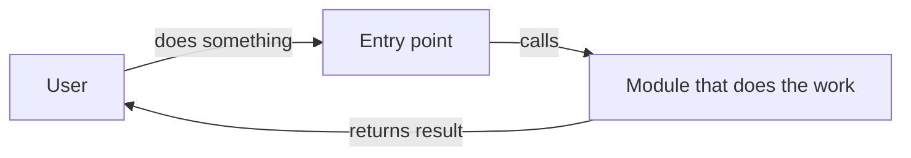

<!-- Frontmatter is OKF per skills/formats/OKF.md. `timestamp` is the canonical date;
     `status`/`owner` mirror the human-facing lines below (OKF models neither). -->

# <Feature Name>

**Status:** Draft | Approved | In Progress | Shipped
**Owner:** <name — primary author and point of contact for follow-up>

<!--
Status values:
- Draft       — being written; not yet reviewed
- Approved    — reviewed; ready to start implementation
- In Progress — implementation underway
- Shipped     — all acceptance criteria checked AND merged to main
-->

## Problem

The pain in one sentence first, then at most two sentences of context. Plain words — see `skills/formats/WRITING-STYLE.md`.

## User Story

As a <role>, I want <capability> so that <outcome>.

## How it works

One diagram of the flow the user goes through, or the parts involved. One idea per diagram; then at most 3 sentences on what to notice. Delete this section if the change has no flow.

## Acceptance Criteria

Each bullet must be testable and map to at least one test. Tick a box only once the test covering it is green and merged — not when implementation starts.

- [ ] Given <context>, when <action>, then <result>.
- [ ] Given <context>, when <action>, then <result>.

## Non-Goals

What this feature explicitly does NOT do. Prevents scope creep.

This is about *capabilities deliberately not built*. (A research note's "Out of Scope" is about *decisions deliberately deferred* — different concept.)

- ...

## Related

Cross-links to other artifacts. Omit any subsection that doesn't apply.

- **ADRs:** [`ADR-NNNN <title>`](../adr/NNNN-slug.md) — why this one matters here
- **Research notes:** [`<topic>`](../research/<topic>.md)
- **Design note:** [`<short-name>.design.md`](./<short-name>.design.md) — when module shape was decided before code

## Notes

Open questions, links, or design tradeoffs. Optional.

## Sign-off

- [ ] Reviewed by <name>
