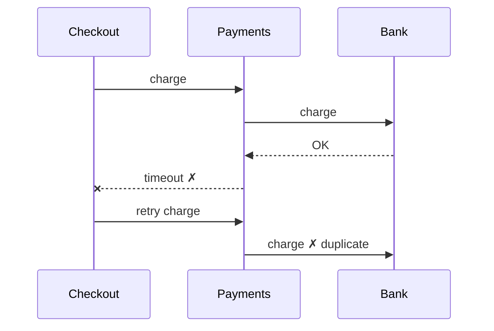

# Writing Style

How to write docs under `docs/` and how to explain things in chat. Comments in code follow their own rule: [`STYLE-comments.md`](STYLE-comments.md).

> **Default:** say the answer first, in plain words. If the idea has movement — steps, order, states, parts that talk — draw it before you describe it.

```
 answer first  ──►  picture (if it moves)  ──►  ≤ 3 sentences on what to notice
```

---

## 1. Answer first

The first sentence is the answer, the decision, or the problem. Background comes after, and only if the reader needs it.

| Instead of | Write |
| --- | --- |
| "After looking at the retry logic and the payment client, it seems that under some conditions…" | "Customers are charged twice when the payment call times out." |
| "There are several factors to consider when choosing a queue…" | "Use Postgres as the queue. We already run it, and our load is small." |

## 2. Plain words

- **Short sentences.** Aim for under 20 words. One idea per sentence.
- **Common words.** "use", not "leverage". "start", not "initiate". "about", not "approximately".
- **Active voice.** "The worker retries the job", not "The job is retried".
- **Example before rule.** Show one concrete case, then state the general point.
- **Cut filler.** "basically", "it's worth noting that", "in order to", "as mentioned above".
- **Define a term the first time you use it** — in one short clause, or with a link.

Domain terms are the exception to "common words". Words from `docs/CONTEXT.md` and [`LANGUAGE.md`](../LANGUAGE.md) (*seam*, *adapter*, *Invoice*) are precise on purpose. Keep them — define or link them on first use instead of swapping in a vaguer word.

## 3. Draw it first

### When to draw

| The explanation has… | Draw | Mermaid type |
| --- | --- | --- |
| Steps in order, or branches | a flow | `flowchart TD` |
| Messages between parts over time | a sequence | `sequenceDiagram` |
| States and what moves between them | a state machine | `stateDiagram-v2` |
| Parts and who depends on whom | boxes and arrows | `flowchart LR` |
| A change in shape | before → after | two small diagrams |
| Options compared on the same criteria | a **table**, not a diagram | — |

**Don't draw** a single fact, a list whose items don't relate to each other, or something ten lines of code already show.

### Which format, where

| Where it's read | Format | Why |
| --- | --- | --- |
| Docs under `docs/` (feature docs, research notes, ADRs, architecture) | Mermaid (a ` ```mermaid ` block) | Renders on GitHub and in most editors; diffs cleanly |
| Chat and terminal answers | ASCII | Terminals don't render Mermaid |
| Code comments | ASCII, and only when the comment itself earns its place per [`STYLE-comments.md`](STYLE-comments.md) | Read in an editor, raw |

Keep ASCII diagrams under ~70 columns so they fit a split terminal pane.

### A good diagram

- **One idea per diagram.** More than about 9 boxes → split it.
- **Label arrows with a verb:** `calls`, `emits`, `retries`, `reads`.
- **Use the code's names** and `CONTEXT.md` terms — not new ones.
- **Mark the problem spot** with `✗` and a two-word label.
- **Then at most 3 sentences** on what to notice. The picture carries the explanation.

## 4. Explaining a problem

Four parts, in this order:

1. **What's wrong** — one sentence, the symptom someone sees.
2. **Why** — a diagram with the failure marked, plus up to 3 sentences.
3. **Fix** — what changes. Draw before → after if the shape changes.
4. **Trade-off** — what the fix costs, in one line.

**Example (chat, ASCII):**

> **What's wrong:** customers are charged twice when the payment call times out.
>
> ```
>  Checkout ──charge──► Payments ──► Bank   (charge OK)
>     ◄──── timeout ✗ ───┘
>  Checkout ──retry───► Payments ──► Bank   ✗ charged again
> ```
>
> **Why:** the charge succeeds, but the reply is lost. Checkout can't tell "failed" from "slow", so it retries and the bank sees a new charge.
>
> **Fix:** send an idempotency key with each charge. Payments returns the first result for a repeated key instead of charging again.
>
> **Trade-off:** Payments must store keys for 24 hours.

**The same "why" in a doc (Mermaid):**

````md

````

## 5. Shape of a doc

- **Every section opens with its point.** A reader skimming only first sentences should get the whole story.
- **Bullets** for three or more parallel items. **Tables** for comparisons. **Paragraphs** of at most 4 sentences.
- **Link, don't repeat.** Point to the ADR, the `CONTEXT.md` entry, or the research note.
- **Rarely-needed detail goes last**, or into a linked note.

## Done when

- [ ] The first sentence of each section is its answer or point.
- [ ] Anything with steps, order, states, or dependencies has a diagram — Mermaid in `docs/`, ASCII in chat.
- [ ] Each diagram shows one idea, uses the code's names, and is followed by at most 3 sentences.
- [ ] Problems are explained as what's wrong → why (picture) → fix → trade-off.
- [ ] No sentence over ~25 words; no filler; every new term is defined or linked once.
